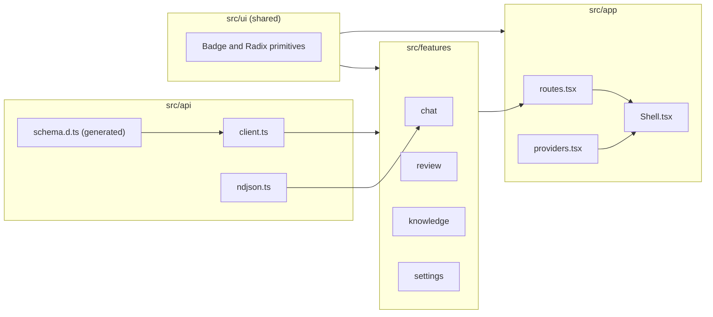

# Frontend architecture

The SPA lives in `frontend/` and is served by the same process as the API
(ADR-0002). The stack and the reasons for it are in
[ADR-0015](../adr/0015-frontend-radix-editorial-router-query.md).

## Design direction

Editorial: a pale, faintly warm paper surface, graphite ink, one fountain-pen blue
accent. It should read as a considered document, not a templated dashboard. All
tokens are defined in `frontend/src/index.css` under Tailwind v4's `@theme`.

**Type roles.** System stacks only: the app is local-first and never fetches remote
fonts.

| Role | Used for | Stack |
|---|---|---|
| `font-display` | Wordmark, `h1`-`h3` (weight 500) | Iowan Old Style, Palatino Linotype, Palatino, Book Antiqua, Georgia, serif |
| `font-sans` | UI text | Inter Variable, Segoe UI, system-ui, sans-serif |
| `font-mono` | Identifiers | ui-monospace, SF Mono, Cascadia Mono, Menlo, Consolas, monospace |

**Tokens.** Values are OKLCH.

| Token | Light | Dark |
|---|---|---|
| `surface` | 97.6% .006 85 | 19.5% .008 70 |
| `card` | 99.4% .003 85 | 23% .009 70 |
| `line` | 88% .01 80 | 34% .01 70 |
| `ink` | 24% .012 70 | 93% .01 85 |
| `ink-muted` | 48% .014 70 | 72% .012 80 |
| `accent` | 44% .12 258 | 78% .09 255 |
| `danger` | 50% .17 28 | 74% .14 28 |

**Semantic colours.** One per proposal classification, each with a soft background.
A badge is always a text label on a tint, never colour alone.

| Classification | Text (light / dark) | Tint (light / dark) |
|---|---|---|
| `new` | 43% .10 150 / 82% .11 150 | 94% .04 150 / 30% .045 150 |
| `known` | 43% .015 250 / 82% .02 250 | 93% .008 250 / 31% .012 250 |
| `duplicate` | 46% .095 70 / 84% .10 80 | 94% .045 85 / 31% .045 75 |
| `conflict` | 48% .16 25 / 80% .11 25 | 94% .035 25 / 31% .06 25 |

**Dark and light.** `color-scheme: light dark`; the dark values are redefined under
`@media (prefers-color-scheme: dark)`. Every text and surface pair clears WCAG AA
(4.5:1) in both schemes (measured in the browser, lowest ratio 5.86). Focus uses a 2px
accent outline, and `prefers-reduced-motion` is respected.

## Module map

Dependencies point one way: `api` knows nothing of the UI, `features` use `api` and
`ui`, and `app` assembles features into routes. A feature never imports another
feature.

## Chat stream contract

`POST /api/chat/messages/stream` returns `application/x-ndjson` (ADR-0014): one JSON
object per line, read with `fetch` and a `ReadableStream` by `api/ndjson.ts`.

| Event | Meaning |
|---|---|
| `delta` | The reply grew; append to the live region |
| `proposal` | The stored proposal (rejected items, nullable id); link to `/review/:id` when the id exists |
| `done` | Normal end of the stream |
| `error` | Failure; the stream ends and the turn is shown as failed |

A stream that ends **without `done`** is an error, not a short reply: a truncated or
dropped connection must never look like a finished answer. A malformed line is also an
error. Assistant replies are not persisted, so a reload loses the transcript.

## Rules that carry risk

**An `edited` operation is already approved.** Each review decision replaces the
previous one, so `accept` after `edit` would silently discard the edit. Cards for an
`edited` operation offer re-edit and reject, never accept. A test asserts it.

**Untrusted text is rendered as text.** Job postings, uploaded documents and model
output may be attacker-controlled. The UI never uses `dangerouslySetInnerHTML`; an
ESLint `no-restricted-syntax` rule fails the lint on it. The UI also has no path that
mutates knowledge except through proposal review (invariants 2 and 4).

## API types

`src/api/schema.d.ts` is generated from `tests/golden/snapshots/openapi.json` with
`npm run gen:api`. CI regenerates it and fails on any diff, so the frontend cannot
drift from the backend contract.
