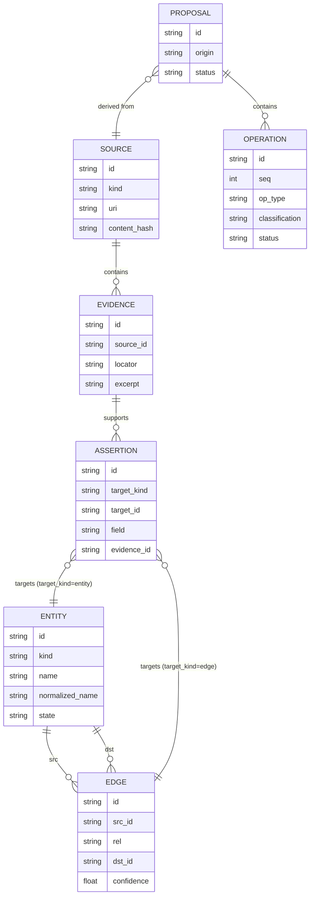
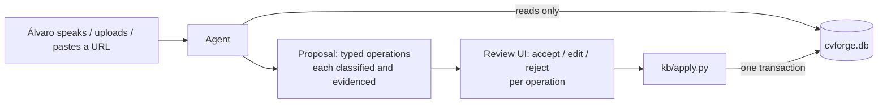

# Knowledge model

## Entity kinds

`skill` · `project` · `organization` · `role` · `education` · `credential` ·
`achievement` · `responsibility`. A *technology* is a `skill` with a category; a
*certification* and a *course* are both `credential` with different
`credential_type` values.

## Relationship vocabulary (closed — never invent a value)

`used_in` · `at_organization` · `produced` · `involved` · `demonstrates` ·
`taught_by` · `part_of` · `related_to`

No entity table carries a foreign key to another entity. An education's
institution, a role's employer and a credential's issuer are all
`at_organization` edges, so relationships live in exactly one place and are
evidenced the same way.

## Knowledge state vs match verdict

`entity.state` is `confirmed | learning | gap | archived`. "Something I have but
have not recorded" is deliberately **not** a state — it is a *match verdict*
(`undocumented`), because by definition such a thing is not in the database. The
four verdicts are `satisfied`, `evidenced`, `undocumented` and `gap`;
`undocumented` and `gap` may never produce a CV claim.

## The write path

Nothing else writes. A database write introduced anywhere outside `kb/apply.py`
is a bug caught by the `provenance-auditor` agent, the `kb-write-path` hook and an
invariant test.
