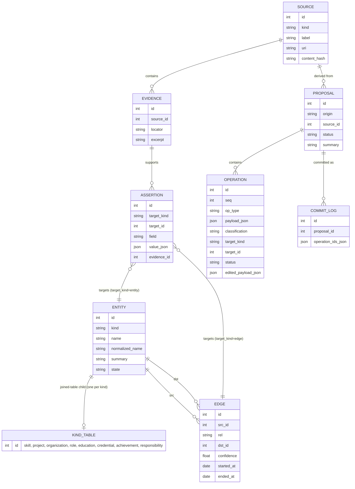
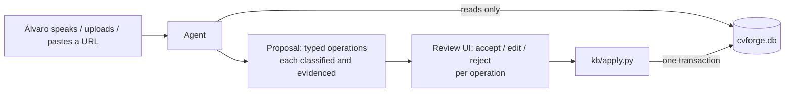

# Knowledge model

The tables are declared in `src/cvforge/kb/schema.py` (SQLAlchemy Core, ADR-0006)
and created by the Alembic revisions in `src/cvforge/kb/migrations/versions/`.
Ids are integers, and all entity kinds share one id space.



`assertion.target_id` is polymorphic (an entity or an edge), so it cannot carry a
foreign key. `queries.orphans()` and `tests/integration/test_invariants.py` check
it instead. Every other reference is a real foreign key, enforced on every
connection (`PRAGMA foreign_keys = ON`), and every closed vocabulary is also a
CHECK constraint.

## Entity kinds

`skill` · `project` · `organization` · `role` · `education` · `credential` ·
`achievement` · `responsibility`. A *technology* is a `skill` with a category; a
*certification* and a *course* are both `credential` with different
`credential_type` values.

## Relationship vocabulary (closed — never invent a value)

`used_in` · `at_organization` · `produced` · `involved` · `demonstrates` ·
`taught_by` · `part_of` · `related_to`

No entity table carries a foreign key to another entity. An education's
institution, a role's employer and a credential's issuer are all
`at_organization` edges, so relationships live in exactly one place and are
evidenced the same way.

## Knowledge state vs match verdict

`entity.state` is `confirmed | learning | gap | archived`. "Something I have but
have not recorded" is deliberately **not** a state — it is a *match verdict*
(`undocumented`), because by definition such a thing is not in the database. The
four verdicts are `satisfied`, `evidenced`, `undocumented` and `gap`;
`undocumented` and `gap` may never produce a CV claim.

## The write path



Nothing else writes. A database write introduced anywhere outside `kb/apply.py`
is a bug caught by the `provenance-auditor` agent, the `kb-write-path` hook and an
invariant test.

### What is written when (ADR-0009)

| Stage | Function in `kb/apply.py` | Writes |
|---|---|---|
| Intake | `record_source`, `record_evidence` | `source`, `evidence` (what was said, not what is true) |
| Proposal | `record_proposal` | `proposal`, `operation` (all `pending`) |
| Review | `review_operation` | one operation's status, plus `edited_payload_json` for an edit |
| Commit | `commit_proposal` | `entity`, kind tables, `edge`, `assertion`, `commit_log`, in one transaction |

A commit refuses while any operation is `pending`. It applies `accepted` and
`edited` operations, skips `rejected` ones, and rolls the whole proposal back if
any of them fails.

### The four classifications

`kb/classify.py` compares each candidate with stored rows. The model does not
decide this.

| Value | Means | Accepting it |
|---|---|---|
| `new` | Nothing stored covers it | Creates or changes rows |
| `known` | Already recorded (same kind and normalized name, field value or edge) | Adds evidence to the existing record |
| `duplicate` | A differently named record is probably the same thing | Links to that record |
| `conflict` | Recorded with a different value | Replaces the value; the old assertion stays as history |

## Backup, export and migrations (NFR-09)

The knowledge base is one file, `data/cvforge.db`. It uses the default rollback
journal rather than WAL, so there are no `-wal` or `-shm` side files. To take a
portable, consistent copy, even while the app is running:

```sh
uv run python -m cvforge.kb.export /path/outside/the/repo/cvforge-copy.db
```

The copy opens with any SQLite tool, and restoring means putting it back at
`data/cvforge.db`. The command refuses to overwrite an existing file.

On startup, the app migrates the database to the newest Alembic revision. If a
migration is pending, it first writes a copy to
`data/backups/cvforge-<revision>-<timestamp>.db`. A schema change is a new file
in `src/cvforge/kb/migrations/versions/`. `tests/integration/test_migrations.py`
fails if the migrated schema and `schema.py` disagree.
