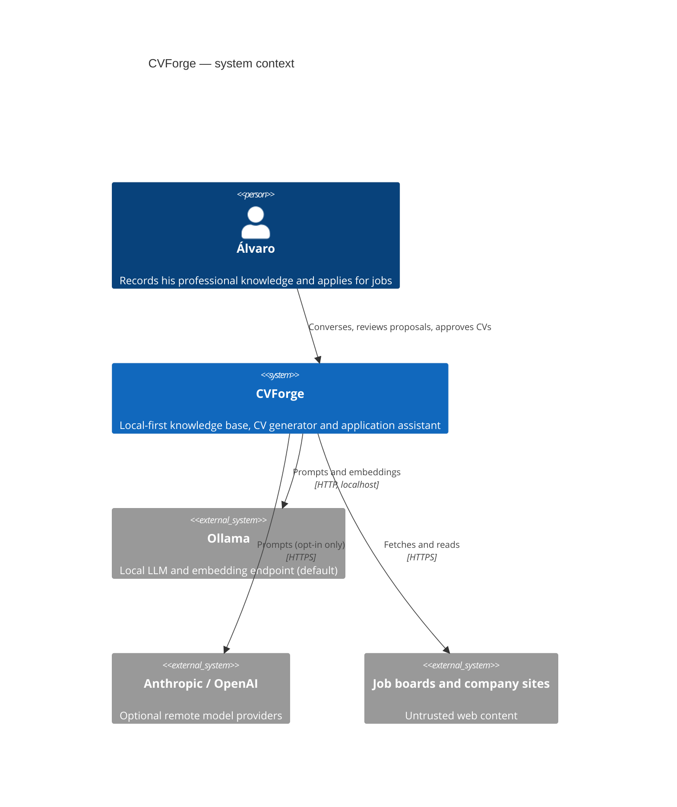
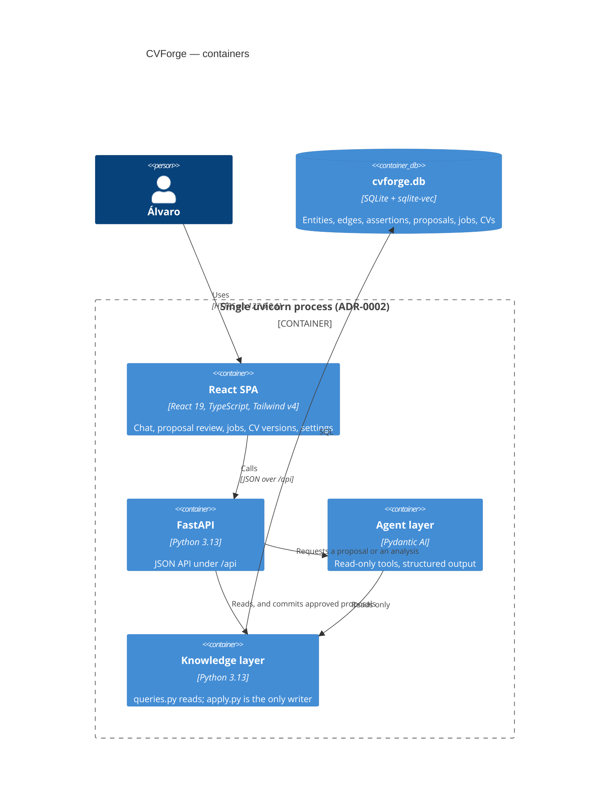

# Architecture overview

## Context

## Containers

## Why the agent cannot write

The arrow from the agent layer to the knowledge layer is read-only, and there is
no arrow from the agent layer to the database. An agent's output is a `Proposal`
— plain data. Only `kb/apply.py`, reached from the API after Álvaro approves
operations, writes. See [ADR-0003](../adr/0003-changeset-review-pipeline.md).
