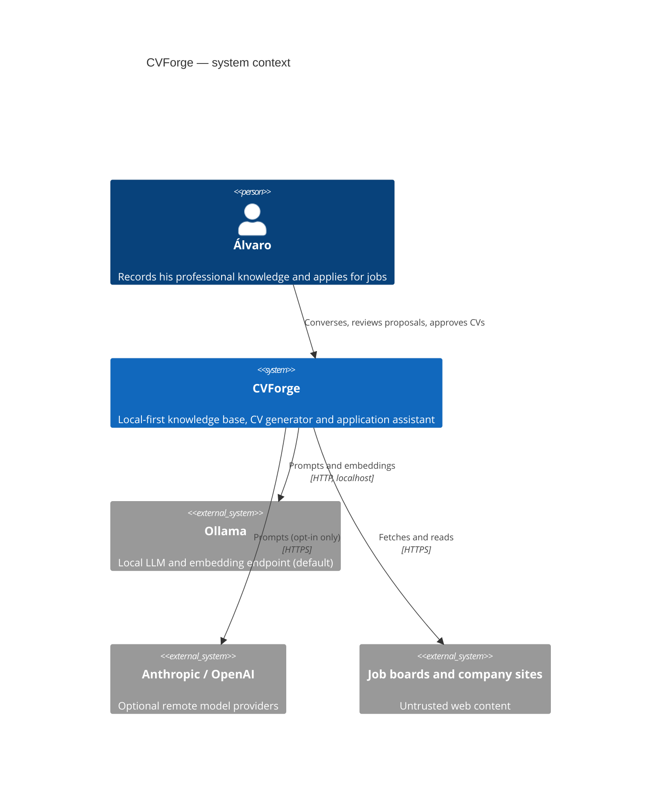
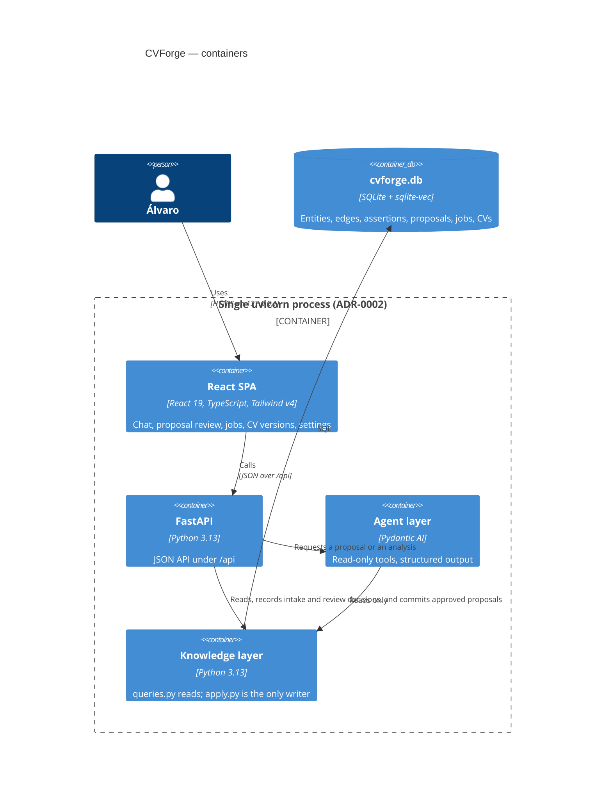

# Architecture overview

## Context

```mermaid
C4Context
  title CVForge — system context
  Person(alvaro, "Álvaro", "Records his professional knowledge and applies for jobs")
  System(cvforge, "CVForge", "Local-first knowledge base, CV generator and application assistant")
  System_Ext(ollama, "Ollama", "Local LLM and embedding endpoint (default)")
  System_Ext(cloud, "Anthropic / OpenAI", "Optional remote model providers")
  System_Ext(boards, "Job boards and company sites", "Untrusted web content")
  Rel(alvaro, cvforge, "Converses, reviews proposals, approves CVs")
  Rel(cvforge, ollama, "Prompts and embeddings", "HTTP, localhost")
  Rel(cvforge, cloud, "Prompts (opt-in only)", "HTTPS")
  Rel(cvforge, boards, "Fetches and reads", "HTTPS")
```

## Containers

```mermaid
C4Container
  title CVForge — containers
  Person(alvaro, "Álvaro")
  Container_Boundary(proc, "Single uvicorn process (ADR-0002)") {
    Container(spa, "React SPA", "React 19, TypeScript, Tailwind v4", "Chat, proposal review, jobs, CV versions, settings")
    Container(api, "FastAPI", "Python 3.13", "JSON API under /api")
    Container(agents, "Agent layer", "Pydantic AI", "Read-only tools, structured output")
    Container(kb, "Knowledge layer", "Python 3.13", "queries.py reads; apply.py is the only writer")
  }
  ContainerDb(db, "cvforge.db", "SQLite + sqlite-vec", "Entities, edges, assertions, proposals, jobs, CVs")
  Rel(alvaro, spa, "Uses", "HTTPS on 127.0.0.1")
  Rel(spa, api, "Calls", "JSON over /api")
  Rel(api, agents, "Requests a proposal or an analysis")
  Rel(agents, kb, "Reads only")
  Rel(api, kb, "Reads, records intake and review decisions, and commits approved proposals")
  Rel(kb, db, "SQL")
```

## Why the agent cannot write

The arrow from the agent layer to the knowledge layer is read-only, and there is
no arrow from the agent layer to the database. An agent's output is a `Proposal`
— plain data. `kb/apply.py`, reached from the API, is the only writer of entity,
edge and assertion rows — it records intake and proposals before review, and
writes those rows only in `commit_proposal`, after Álvaro has reviewed every
operation. A small, explicitly registered set of other writers (ADR-0011) may
write specific *non-knowledge* state directly from the API — today, only
`llm/settings_store.py` writing the LLM provider settings — and are barred from
ever touching a knowledge table. See
[ADR-0003](../adr/0003-changeset-review-pipeline.md),
[ADR-0009](../adr/0009-review-pipeline-semantics.md) and
[ADR-0011](../adr/0011-registered-writers-for-non-knowledge-state.md).
